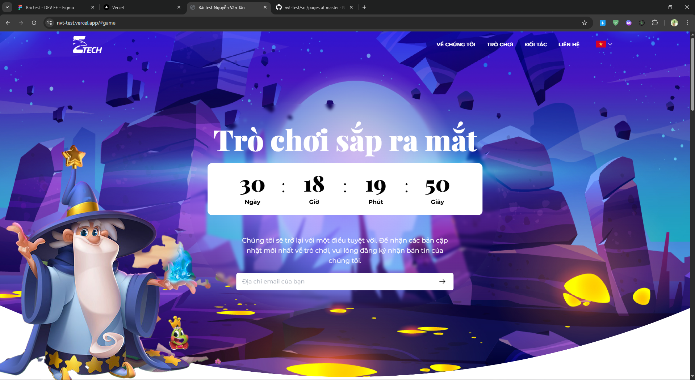
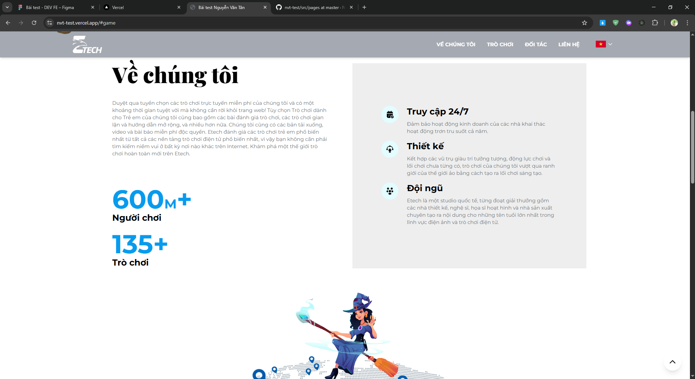
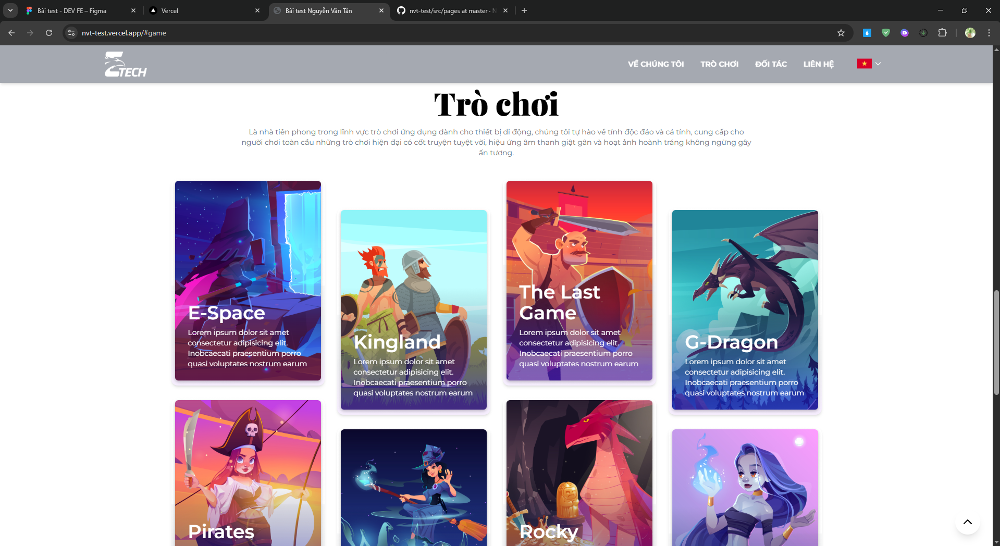
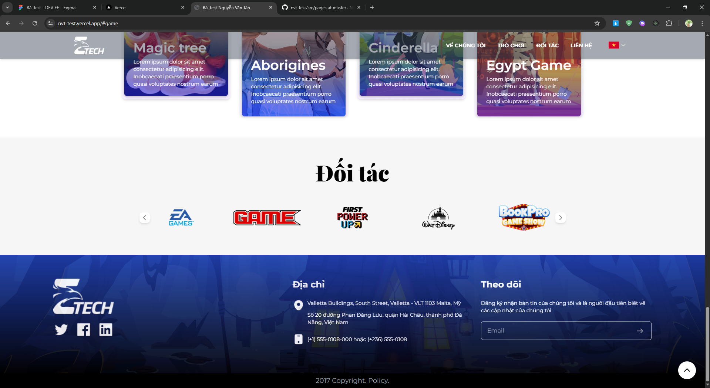
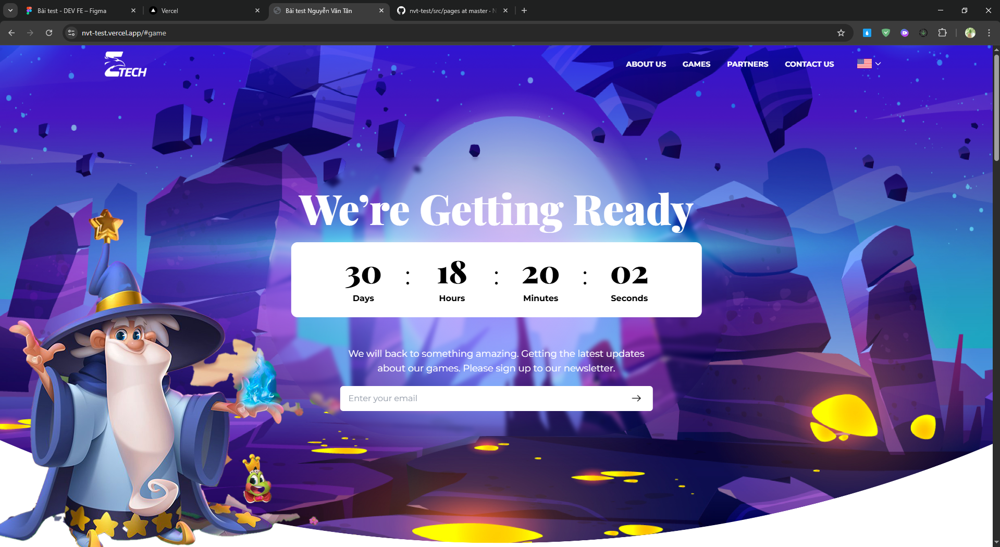
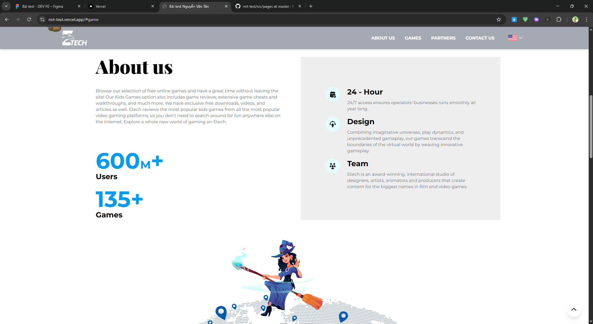
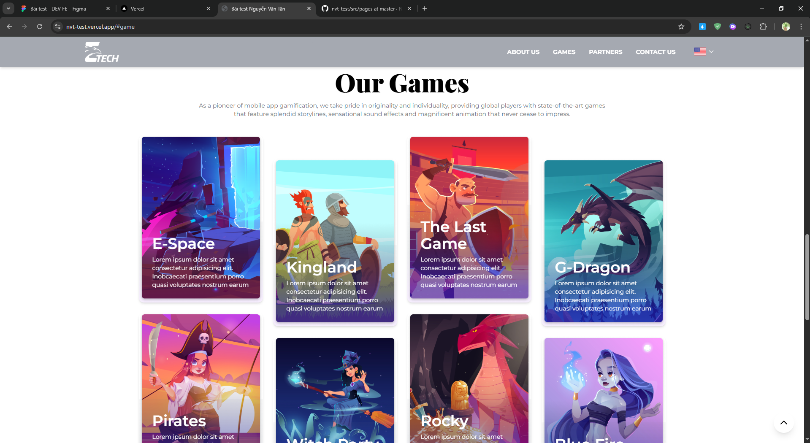

# 🚀 Dự án React + TypeScript + TailwindCSS

### 🙏 Cảm ơn bạn đã dành thời gian xem xét dự án của tôi, chúc bạn một ngày tốt lành !

Đây là một ứng dụng web được xây dựng bằng **ReactJs**, **TypeScript** và **TailwindCSS** được responsive để sử dụng các thiết bị khác nhau.

### Mục tiêu của dự án:
Cung cấp cho người dùng thông tin về các trò chơi của chúng tôi, các trò chơi sắp ra mắt và thời gian ra mắt. Nhận thông tin về trò chơi mới nhất từ chúng tôi qua email

---

## 🔗 Demo

👉 [Xem bản demo tại đây](https://nvt-test.vercel.app/)

---

## 📸 Hình ảnh demo

### Giao diện (Tiếng việt):






### Giao diện (Tiếng Anh):





---

## ⚙️ Cài đặt & Chạy dự án

```bash
# Clone repo
git clone https://github.com/NguyenVanTan97/nvt-test.git
cd nvt-test

# Cài đặt dependencies
npm install

# Chạy project
npm run dev or yarn start
```
